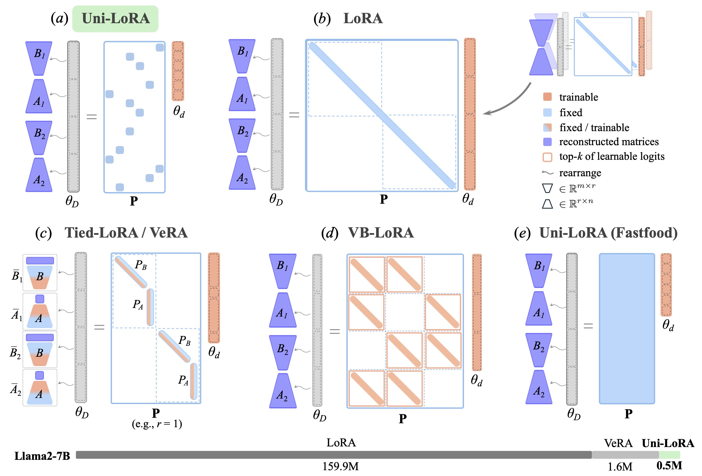

##  [NeurIPS 2025 Spotlight] Uni-LoRA: One Vector is All You Need

This repo contains the source code of [Uni-LoRA: One Vector is All You Need](https://arxiv.org/abs/2506.00799).

Uni-LoRA is implemented following the standard interface of the 🤗 Hugging Face Parameter-Efficient Fine-Tuning (PEFT) library (see instruction_tuning/peft), making it easy to integrate into existing workflows. Our implementation is fully compatible with PEFT, and we plan to submit it for potential inclusion in the official PEFT library in the future.

 
<p align="center">

</p>

## Abstract
Low-Rank Adaptation (LoRA) has become the de facto parameter-efficient fine-tuning (PEFT) method for large language models (LLMs) by constraining weight updates to low-rank matrices. Recent works such as Tied-LoRA, VeRA, and VB-LoRA push efficiency further by introducing additional constraints to reduce the trainable parameter space. In this paper, we show that the parameter space reduction strategies employed by these LoRA variants can be formulated within a unified framework, **Uni-LoRA**, where the LoRA parameter space, flattened as a high-dimensional vector space $\mathbb{R}^{D}$, can be reconstructed through a projection from a subspace $\mathbb{R}^{d}$, with $d\ll D$. We demonstrate that the fundamental difference among various LoRA methods lies in the choice of the projection matrix, $P \in \mathbb{R}^{D\times d}$. Most existing LoRA variants rely on layer-wise or structure-specific projections that limit cross-layer parameter sharing, thereby compromising parameter efficiency. In light of this, we introduce an efficient and theoretically grounded projection matrix that is isometric, enabling global parameter sharing and reducing computation overhead. Furthermore, under the unified view of Uni-LoRA, this design requires only a single trainable vector to reconstruct LoRA parameters for the entire LLM — making Uni-LoRA **both a unified framework and a "one-vector-only" solution**. Extensive experiments on GLUE, mathematical reasoning, and instruction tuning benchmarks demonstrate that Uni-LoRA achieves state-of-the-art parameter efficiency while outperforming or matching prior approaches in predictive performance.

<!---!**Uni-LoRA**  introduces a fixed, sparse, and isometric projection matrix $\mathbf{P}^{(D × d)}$, where $d<<D$ and each row contains exactly one nonzero entry. By multiplying $\mathbf{P}$ with a compact trainable vector $\theta_d$ (length $d$), Uni-LoRA reconstructs the full LoRA parameter $\theta_D$ (length $D$), enabling efficient fine-tuning with minimal trainable parameters and no architectural modifications.--->

Empirically, Uni-LoRA matches the performance of standard LoRA while updating only 0.52M parameters on GEMMA-7B — only 0.0061% of the base model size and 0.26% of the LoRA parameter count. 

## Steps to reproduce the results

## NLU
- Code for running experiments for Natural Language Understanding experiments.
- 重构了代码使其完全融入了hugging face的peft包架构
#### Create and activate conda env
```console
cd NLU/NLU
conda env create -f environment.yml
conda activate Uni_LoRA_NLU
```
#### Install the pre-requisites
uni-lora:
```console
pip install -e ..
```
NLU:
```console
pip install -e .
```
#### Start the experiments
The scripts are located in the "NLU/scripts_unilora_qv".

For example,
```console
./scripts_unilora_qv/roberta_base_mrpc.sh


## Instruction Tuning

- The code for running Llama2 is adapted from [qlora source code](https://github.com/artidoro/qlora).
- Fine-tuning the Llama2 model requires access to the model weights on HuggingFace. Ensure you have the access before running the code.
- The bitsandbytes package in the environment may require local compilation. Please refer to the [official installation guide](https://github.com/bitsandbytes-foundation/bitsandbytes/blob/main/docs/source/installation.mdx) for detailed instructions.

#### Create and activate conda env
```console
cd instruction_tuning
conda create -n instruction_tuning python==3.10
conda activate instruction_tuning
```

#### Install the pre-requisites
```console
pip install -r requirements.txt
cd peft
pip install -e .
```

#### Start the experiments
The scripts are located in the "instruction_tuning/scripts" folder.

For example,
```console
cd instruction_tuning
./scripts/finetune_llama2_7b_unilora.sh
```

For evaluation, please use [LLM Judge](https://github.com/lm-sys/FastChat/tree/main/fastchat/llm_judge).

## Math Instruction Tuning
#### Create and activate conda env
```console
cd math_instruction_tuning
conda create -n math_instruction_tuning python==3.8.13
conda activate math_instruction_tuning
```

#### Install the pre-requisites
```console
pip install -r requirements.txt
cd peft
pip install -e .
```

#### Start the experiments
The scripts are located in the "instruction_tuning/scripts" folder.

For example,
```console
cd math_instruction_tuning
./run_instruction_tuning_unilora.sh
```


## ViT Tuning
#### Create and activate conda env
```console
cd math_instruction_tuning
conda create -n ViT_tuning python==3.8.13
conda activate ViT_tuning
```

#### Install the pre-requisites
```console
pip install -r requirements.txt
cd peft
pip install -e .
```

#### Start the experiments
```console
./run_vit_base.sh
./run_vit_large.sh
```


## NLU
- Modified code for running experiments for Natural Language Understanding experiments.
- Adapted from [LoRA source code](https://github.com/microsoft/LoRA).
#### Create and activate conda env
```console
cd NLU/NLU
conda env create -f environment.yml
conda activate Uni_LoRA_NLU
```
#### Install the pre-requisites
uni-lora:
```console
pip install -e ..
```
NLU:
```console
pip install -e .
```
#### Start the experiments
The scripts are located in the "NLU/scripts_unilora_qv".

For example,
```console
./scripts_unilora_qv/roberta_base_mrpc.sh
```


## Citation
If you found this code useful, please cite our paper.

```  
@inproceedings{li2025unilora,
      title={Uni-LoRA: One Vector is All You Need}, 
      author={Kaiyang Li and Shaobo Han and Qing Su and Wei Li and Zhipeng Cai and Shihao Ji},
      booktitle={The 39th Conference on Neural Information Processing Systems (NeurIPS)},
      year={2025}
}
```  

## Acknowledgment
Our Fastfood projection implementation used in the ablation study is based on the implementation from [rojagtap/intrinsic-dimension-lm-fine-tuning](https://github.com/rojagtap/intrinsic-dimension-lm-fine-tuning). We sincerely thank the authors for making their code publicly available.
